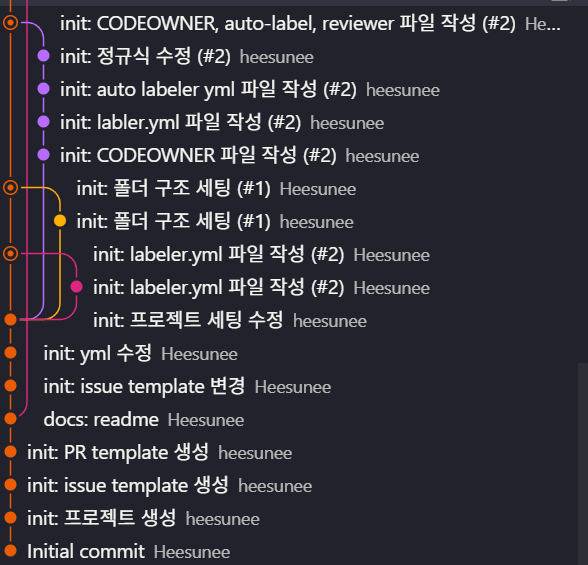
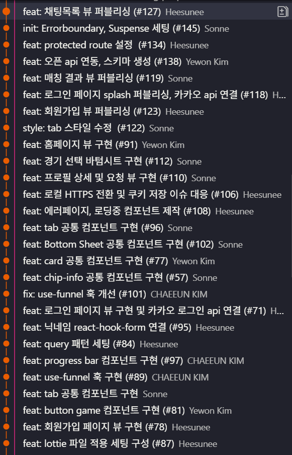

# 🧩 Git 전략 & 컨벤션

<aside>

📌 Git 관리를 효율적으로 진행해 협업을 유연하게 하자.
</aside>

물론! 아래처럼 조금 더 자세하게, 왜 **Squash Merge**를 쓰는지와 어떻게 진행하는지 단계별로 설명해 봤어.

---

## 🟠 Squash Merge 전략

메잇볼 팀은 **Squash Merge** 방식을 채택해 깔끔하고 관리하기 쉬운 커밋 이력을 유지합니다.

### ✔️ Squash Merge란?

* 여러 개의 커밋을 **하나의 커밋으로 합쳐서 병합**하는 방식입니다.
* PR 하나당 최종적으로 하나의 커밋 기록만 남게 되어, 깔끔한 히스토리를 만듭니다.
* 불필요한 중간 커밋이나 실험적인 커밋 메시지가 히스토리를 어지럽히지 않도록 방지합니다.

### ✔️ Squash Merge를 사용하는 이유

* **가독성 향상**
  복잡한 커밋 로그 대신, 기능 단위별로 명확하고 간결한 커밋 메시지를 볼 수 있습니다.
* **유지보수 용이**
  변경 사항이 한 눈에 파악되어 버그 수정이나 롤백 작업이 더 쉽습니다.
* **PR 단위 관리**
  기능별 PR이 하나의 커밋으로 정리되므로, 어떤 PR이 어떤 변경을 포함하는지 명확합니다.

### ✔️ Squash Merge 진행 절차

1. **feature 브랜치에서 작업을 완료합니다.**
   여러 개의 커밋을 자유롭게 만들고 작업합니다.

2. **develop 브랜치와 변경사항을 동기화(rebase) 합니다.**

   ```bash
   git fetch origin
   git rebase origin/develop
   ```

   * 최신 `develop` 브랜치 기준으로 내 작업을 다시 쌓아 올려, 커밋 충돌을 최소화하고 히스토리를 깔끔하게 유지합니다.

3. **PR(Pull Request)을 생성하여 리뷰를 요청합니다.**

4. **리뷰가 완료되면, Squash Merge를 선택하여 병합합니다.**

   * 여러 개의 커밋이 하나로 합쳐져 `develop` 브랜치에 병합됩니다.
   * PR 제목이 최종 커밋 메시지로 사용되며, 필요 시 상세 내용을 추가할 수 있습니다.

---

### ✔️ 참고

* Squash Merge 시, 각 커밋의 중간 메시지는 최종 히스토리에 남지 않으니 커밋 메시지에 핵심 내용을 잘 작성하는 것이 중요합니다.
* 협업 시 **rebase와 Squash Merge 규칙을 모두 지키면**, 깔끔한 커밋 관리와 충돌 최소화가 가능합니다.


### 🔍 비교: 일반 Merge vs Squash Merge



#### 도입 후 



___

## 🔀 브랜치 전략

1. **`main`** : 오직 배포를 위한 브랜치  
2. **`develop`** : 모든 기능이 병합되는 공통 브랜치 (기본 브랜치)  
3. **`feature/style 등`** : 작업 단위별 기능 브랜치  

---

## ❓ 왜 3브랜치 전략인가?

<aside>
우리 팀은 브랜치 전략을 정할 때 **짧은 앱잼 기간**과 **최소한의 협업 구조**를 기준으로 선택했습니다.

* `release`나 `hotfix` 브랜치처럼 브랜치를 세분화하면 관리 부담이 커질 수 있어
* 대신, 배포용 `main`, 통합용 `develop`, 작업용 `feature`만 구분해 효율을 극대화했습니다.

</aside>

---

## ☁️ 배포 플로우 (with Cloudflare)

* `main 브랜치` → Cloudflare Pages 자동 배포
* GitHub Actions로 변경 감지 시, 개인 레포로 자동 푸시됨


---

## ✅ Issue 템플릿

* 제목: **`feat: 로그인 기능 구현`**

> 템플릿 제목의 `[기능]`은 커밋 컨벤션 키워드를 기준으로 작성합니다.

---

## ✅ PR 템플릿

* 제목: **`feat: 로그인 기능 구현`**

```md
## #️⃣ Related Issue
Closes #

## ☀️ New Insight
<!-- 새롭게 알게 된 부분을 적어주세요 -->

## 💎 PR Point
<!-- 트러블 슈팅, 공통 컴포넌트 사용 방법, 고민한 로직 등 -->

## 📸 Screenshot
<!-- UI 작업 시 첨부 필수 -->
```

> PR에는 리뷰어가 맥락을 이해할 수 있도록 최대한 자세히 적습니다.
> 팀원에게 도움이 된 리뷰에는 `굿 리뷰` 라벨을 달아주세요! 💡

---

## 🧷 커밋 컨벤션

<aside>
📌  
커밋 메시지 기본 형식은 다음과 같습니다:

```
{type}: 커밋 메시지 (#이슈번호)
ex) feat: 로그인 기능 구현 (#23)
```

</aside>

| Type               | 설명                          |
| ------------------ | --------------------------- |
| `init`             | 초기 세팅                       |
| `setting`          | 개발 환경 설정 (패키지, config 등)    |
| `feat`             | 기능 개발                       |
| `fix`              | 버그 수정                       |
| `style`            | 스타일 / CSS 변경                |
| `api`              | API 통신 관련 코드                |
| `refactor`         | 리팩토링                        |
| `chore`            | 패키지 설치 / 빌드 설정 (프로덕션 코드 제외) |
| `deploy`           | 배포 관련 설정                    |
| `comment`          | 주석 추가 또는 수정                 |
| `test`             | 테스트 코드 추가                   |
| `rename`           | 파일 또는 폴더명 변경                |
| `remove`           | 파일 삭제                       |
| `docs`             | 문서 수정                       |
| `!HOTFIX`          | 긴급 수정                       |
| `!BREAKING CHANGE` | 대규모 구조 변경 시 사용              |

---

## 🌿 브랜치 네이밍 규칙

<aside>
📌  
브랜치 이름은 소문자로, `/`를 기준으로 구조화합니다.

```
{type}/#이슈번호/기능명
ex) feat/#23/login-page
```

</aside>

* PR 머지 후 브랜치는 **삭제**
* 머지 방식: **squash merge**

---

> 🙌 모두가 이해할 수 있고, 깔끔한 Git 이력을 남기는 것이 목표입니다.

