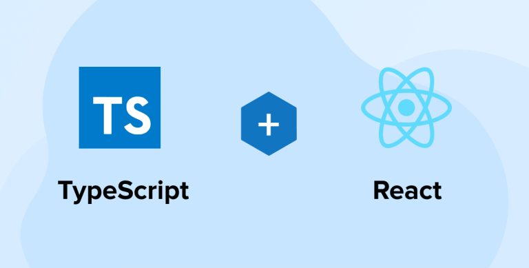
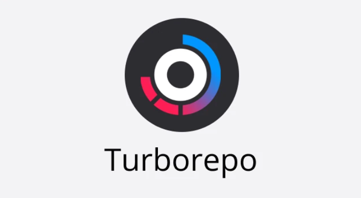
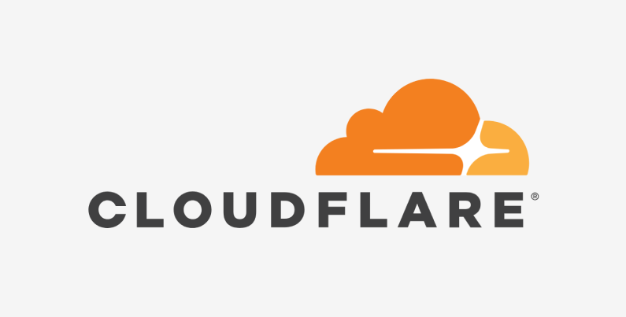

# 🛠️ 기술 스택 선정 이유

본 프로젝트는 **짧은 개발 기간**, **작은 인원**, 그리고 **빠른 피드백과 반복적인 개선**이 핵심이 되는 환경에서 진행되었습니다. 우리는 빠르게 개발을 시작하고 안정적으로 유지보수할 수 있는 기술 스택을 우선적으로 고려했습니다.  

기술 선정의 기준은 다음과 같았습니다
- 팀원이 기존에 사용 경험이 있어 빠르게 진입 가능한 기술
- 협업 과정에서 충돌을 줄이고 생산성을 높일 수 있는 구조
- 배포 및 운영까지의 흐름이 단순하고 가벼운 도구

이러한 배경에서, 다음과 같은 기술들을 선정하고 적용하게 되었습니다.

## React & TypeScript

 

React는 UI를 컴포넌트 단위로 나누어 구성할 수 있어 유지보수가 쉽고 역할 분담이 명확한 구조를 제공합니다. 프로젝트 초기부터 팀원들이 React에 익숙했기 때문에 별도의 학습 기간 없이 빠르게 개발에 착수할 수 있었고, 문제가 발생했을 때도 넓은 커뮤니티와 풍부한 레퍼런스를 통해 빠르게 해결할 수 있었습니다. TypeScript는 정적 타입 시스템을 통해 컴파일 단계에서 오류를 사전에 방지하고, 함수나 컴포넌트 간의 인터페이스를 명확히 정의하여 협업 효율성을 크게 높여주었습니다. 특히 여러 명이 동시에 작업하는 환경에서 TypeScript의 타입 정의는 명확한 계약서 역할을 하며 코드 충돌을 줄이는 데 효과적이었습니다.

 

한편, 모노레포나 터보레포는 사용하지 않았습니다. 프로젝트 규모가 크지 않고 패키지 분리가 필요한 복잡한 구조도 아니었기 때문에, 단일 레포지토리로 작업하는 것이 훨씬 간결하고 효율적이었습니다. 또한 짧은 개발 기간 안에 빠르게 피드백을 주고받아야 하는 상황에서는 복잡한 레포 관리보다 단일 구조에서 집중하는 것이 더 실용적이라고 판단했습니다.

## CSS 라이브러리: Tailwind vs Vanilla Extract

 

스타일링 도구로는 Vanilla Extract와 Tailwind CSS를 두고 고민했습니다. Vanilla Extract는 스타일과 로직이 분리되어 깔끔한 구조를 유지할 수 있고, 타입스크립트와 연동되어 타입 안전성과 디자인 토큰 기반 시스템 구현에 유리했습니다. 정적 스타일 추출 방식으로 성능 부담도 적었습니다. 그러나 컴포넌트와 스타일 파일이 분리되어 있어 맥락 파악에 시간이 걸릴 수 있고, 팀원들이 이 툴에 익숙하지 않아 러닝 커브가 존재했습니다. 짧은 기간 동안 빠르게 개발해야 하는 환경에서는 진입 장벽이 있는 도구였습니다.

Tailwind CSS는 유틸리티 클래스 기반이라 빠른 스타일링이 가능하다는 장점이 있었지만, 클래스명이 많아지면 가독성이 떨어질 수 있다는 우려가 있었습니다. 하지만 v4부터 Rust 기반 엔진이 도입되며 빌드 속도가 크게 개선되었고, 최신 CSS 기능(JIT 최적화, 컨테이너 쿼리, OKLCH 색상 시스템 등)을 지원하며 생산성과 디자인 품질 모두에서 긍정적인 변화를 가져왔습니다. 실제 프로젝트에서는 `cn`, `cva` 같은 유틸리티 함수로 클래스 관리를 체계화해 가독성 문제를 어느 정도 해소했고, 빠른 개발 속도와 유지보수 효율성을 고려해 최종적으로 Tailwind CSS를 선택했습니다.

## Biome 도입 배경

 

기존의 포매터와 린터 조합인 Prettier와 ESLint는 각각 설정이 복잡하고, 여러 플러그인과 설정 파일 간의 충돌로 인해 개발 흐름을 방해하는 경우가 자주 있었습니다. 특히 TypeScript 환경에서는 tsconfig와 eslint, prettier 설정 간의 충돌을 조정하느라 시간을 소모하는 일이 반복되었습니다. CI 환경에서도 각각을 병렬 실행해야 했기 때문에 빌드 시간이 길어졌습니다.

이러한 문제를 해결하기 위해 Biome을 도입했습니다. Biome은 Rust 기반으로 매우 빠르게 실행되며, 포매팅과 린팅을 하나의 도구로 통합해 설정 복잡도를 획기적으로 줄였습니다. `.biome.json` 파일 하나로 필요한 설정을 관리할 수 있고, 별도의 플러그인 없이도 TypeScript와 JSX, React를 기본적으로 지원합니다. 기존 Prettier와 유사한 포맷 호환성을 제공하면서도, 설정 간 충돌이 거의 없고 오류 메시지도 명확해 유지보수에 큰 도움이 되었습니다. Biome 하나만으로 CI 최적화가 가능해졌고, 개발자 경험도 크게 향상되었습니다.

## Cloudflare Pages 선정 이유

 

배포 플랫폼으로는 Cloudflare Pages를 선택했습니다. 프로젝트는 CSR 기반의 SPA로 구성되어 있었기 때문에, Next.js의 SSR 기능이나 Edge Function 최적화 같은 기능을 제공하는 Vercel의 강점을 활용할 수 없는 구조였습니다. 또한 Vercel은 팀 프로젝트에서 Organization Repository로 배포할 경우 유료 플랜을 요구해 접근성이 떨어졌고, Netlify 역시 유사한 제약이 있었습니다.

반면 Cloudflare Pages는 모든 기능이 무료로 제공되며, Organization Repository도 제한 없이 사용할 수 있습니다. GitHub 연동만으로 자동 빌드 및 배포가 가능했고, 각 PR마다 자동으로 생성되는 Preview 환경은 팀 협업에 큰 도움을 주었습니다. 비개발자나 디자이너도 간편하게 URL을 통해 결과물을 확인하고 피드백을 줄 수 있었으며, 설정 과정이 직관적이고 단순해 배포 관리의 부담이 거의 없었습니다. 글로벌 CDN 기반으로 배포 속도도 매우 빠르고, 별도 설정 없이 SSL 인증이 자동 적용되는 점도 장점이었습니다.

물론 Vercel이나 Netlify에 비해 문서나 레퍼런스는 다소 부족한 편이지만, 우리 프로젝트처럼 SSR이 필요 없는 정적 SPA에는 Cloudflare Pages가 가장 적합한 선택이었습니다. 경량화된 배포, 자유로운 협업 환경, 쉬운 설정 등 모든 조건을 고려했을 때, 저희 프로젝트의 목적과 가장 잘 맞는 플랫폼이었습니다.
